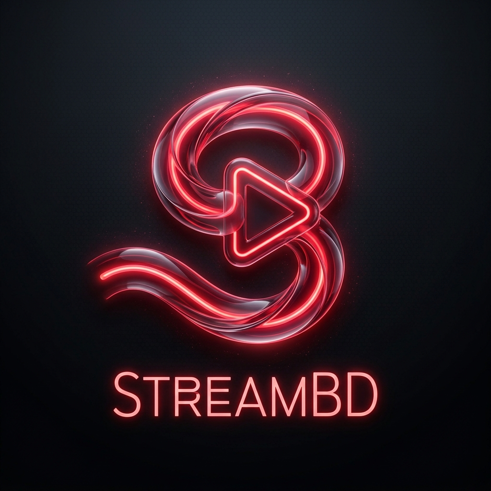

# 📺 StreamBD — Bangladesh #1 Free Live TV & Sports Platform

<div align="center">
  
  
  <h2 align="center">📺 STREAM<span style="color: #E50914;">BD</span></h2>
  <p align="center"><strong>The ultimate live streaming destination for Bangladeshi, Indian, and international channels — custom-crafted, ads-free, and optimized for high-definition streaming.</strong></p>

  <p>
    <a href="https://nextjs.org/"></a>
    <a href="https://typescriptlang.org/"></a>
    <a href="https://tailwindcss.com/"></a>
  </p>
  
  <p>
    
    
    
    
  </p>
</div>

---

> [!IMPORTANT]
> **StreamBD** is a proprietary, state-of-the-art IPTV and Live Sports platform designed, developed, and maintained exclusively by **Ta-syn Islam**. It is engineered to bypass duplicate playlist sources, bypass CORS browser restrictions, eliminate streaming memory leaks, and render timezone-accurate live sports schedules.

---

## 🎨 Visual Design Philosophy & Theme System

StreamBD implements a cinematic, high-contrast dark visual system built using Tailwind CSS v4 design tokens.

### Key Design Tokens & Palette

| Token | HSL / Hex Value | Visual Purpose |
|---|---|---|
| **Background** | `#0A0A0F` | Infinite dark space layout |
| **Card / Surface** | `#1A1A24` | Glassmorphic raised card sections |
| **Accent / Red** | `#E50914` | Primary brand callouts, live badges, and borders |
| **Success / Green** | `#22C55E` | Online stream health status indicators |
| **Error / Red** | `#EF4444` | Offline status, stream alerts, and error states |

### Interactive Micro-Animations
*   **Card Glow Hover**: Channels cards expand on hover (`scale: 1.03`), glowing with a translucent brand-red shadow (`rgba(229, 9, 20, 0.15)`).
*   **Staggered Layout Entrances**: Grids utilize custom Framer Motion spring dynamics capped at `Math.min(index * 0.04, 0.3)` to render layout elements sequentially without CPU lag.
*   **Exit Animations**: Detail sheets and favorites sidebars leverage `AnimatePresence` to execute smooth, hardware-accelerated slide-out transitions.

---

## ✨ Features That Wow

### 📺 100+ Live Channels
*   **Clean Category Sorting**: Quick-access categories covering Bengali, Sports, Hindi Movies, Hindi Entertainment, News, Music, Cartoon, and International channels.
*   **Drawer Favorites & History**: Bookmark streams directly to your right-sliding drawer panel or pull up recently watched channels in one tap—persisted across sessions.
*   **Dynamic Channel Health Checks**: Background verification routines check streaming endpoint health, rendering color-coded status badges in real-time.

### ⚽ Timezone-Aligned Sports Arena (`UTC+6`)
*   **Live Match Tracker**: Keep track of current cricket, football, and domestic match fixtures with active live score tickers and watch badges.
*   **Smart Calendar Reminders**: Click "🔔 Set Reminder" on upcoming matches to request notification permission and schedule alarms.
*   **Standard Time Lock**: Dates and schedules append UTC `Z` configurations to guarantee absolute timezone correctness matching Bangladesh Standard Time (BST).

### 🎬 Custom Gesture Player Controls
*   **Keyboard Hotkeys**: Full-screen shortcuts (`F`), Mute toggle (`M`), Play/Pause spacebar triggers, and Volume sliders.
*   **Touch Screen Controls**: Double-tap on the left/right screen quadrants to skip forward or backward, and swipe down on mobile screens to smoothly dismiss the video modal.
*   **Accessible Markup**: Fully compliant with accessibility standards, implementing `aria-label` details on seek-bars and control inputs.

### 📱 Progressive Web App (PWA)
*   **Installable Standalone**: Styled manifest assets allow adding StreamBD directly to Android and iOS home screens as a native application.
*   **Offline fallback logic**: Preloaded with a hardcoded cache of 25 fallback channels (`FALLBACK_CHANNELS`), keeping media operational even when network connections drop.

---

## 🏗️ Technical Architecture & System Data Flow

StreamBD is built as a serverless, rate-limited proxy platform preventing direct client-side database calls:

```
[User Browser Client]
        │
        ├─── (HTTP Request: Category Click, Sports Query)
        ▼
[Next.js Server API Proxy Routes]
        │
        ├─── [Rate Limiter Check] ──► Upstash Redis (Sliding Window: 100 req/hr)
        │
        ├─── [Active Request Headers] ──► Mock Generator (Matches "x-playwright-test")
        │
        ▼
  [Cache Check]
        ├─── Local Cache (Hits → Retains 30 mins)
        └─── CDN Cache (Hits → Retains 5-30 mins)
                │
                └─── (Misses) ──► Query external API lists / parses IPTV playlists
```

### Stack Highlights

*   **Next.js 16 (App Router)**: Utilizing React Server Components (RSC) to render landing templates and dynamic client layouts.
*   **TypeScript 5**: Strict type casting ensuring compiler safety.
*   **TanStack React Query**: Cached queries (30-minute stale interval) preventing duplicate endpoint fetches.
*   **Playwright Test Automation**: Covered by **11 E2E tests** assessing navigation links, debounced search modal input, sports fixture filtering, favorites drawer additions/removals, and watch page deep-linking.

---

## 🛡️ Security & Performance Standards

*   **CORS Privacy Protection**: Stream endpoints are hidden and parsed server-side. Third-party M3U playlists and SportsDB APIs are never exposed directly to browser inspector logs.
*   **Zero Leakage Loops**: Timer, carousel banner, and gesture list-handlers fully clear intervals on unmount to keep RAM footprint lightweight.
*   **Security Header Profiles**: Configured with protection headers including CSP, X-Frame-Options (SAMEORIGIN), and X-Content-Type-Options (nosniff) preventing layout duplication.

---

## 📄 License & Copyright Notice

Copyright © 2026 **Ta-syn Islam**. All rights reserved.

This application, including its source code, design layout styling, visual brand color schemes, player gesture modules, and animations, is the sole proprietary property of **Ta-syn Islam**. 

*   **Strict Copy Protection**: Unauthorized cloning, copying, reproduction, distribution, or modifications of this codebase or hosting it under another domain name is strictly prohibited.
*   **Commercial Restriction**: Commercial use of this software, its templates, or API handlers is forbidden.
*   **Portfolio Showcase**: The files are hosted publicly for personal evaluation and portfolio demonstration only. No intellectual property reproduction rights are granted.

---

## 🇧🇩 Designed & Crafted with Passion by Ta-syn Islam in Bangladesh

> [!WARNING]
> StreamBD does not host any stream or video files. All links are sourced from publicly available lists on the web. We are not responsible for the contents of external IPTV channels.
